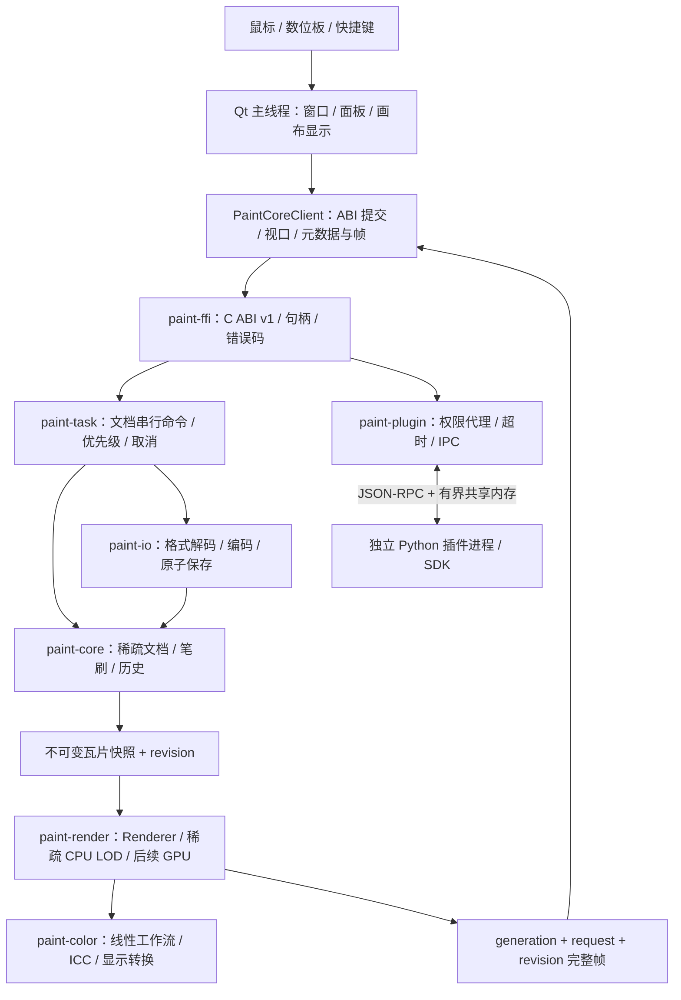

# DrawVerse 架构设计

状态：2026-10-08 已实施 paint-core、paint-task、CPU paint-render、paint-io、paint-ffi ABI 1.5 与 QML UI；隔离组见 groups-design.md，显示透明棋盘格见 transparency-design.md。异步任务/视口细节见 task-render-design.md；IO 实施细节见 io-design.md；下文 GPU、色彩、PSD/自有格式、插件仍为后续设计。

## 分层与数据流



Rust crate 的依赖有向无环：paint-core 为纯模型库；paint-color 不依赖 UI；paint-render 依赖 core/color；paint-io 依赖 core/color；paint-task 调度抽象不依赖 Qt；paint-plugin 经受限命令服务访问文档；paint-ffi 组装以上模块。UI 仅链接 paint-ffi。Python SDK 仅访问代理协议。

| 模块 | 职责 | 不能做 |
|---|---|---|
| paint-core | 文档、图层树、瓦片、笔刷、历史、选区、变换 | Qt、设备驱动、文件弹窗、GPU 设备管理 |
| paint-render | Renderer trait、CPU 合成、GPU 上传和缓存、脏区域、帧调度 | 改写权威文档、假定 UI 线程 |
| paint-color | 工作/文档/显示色彩空间、ICC、16/32F 转换、HDR 描述 | 绑定单一屏幕、把显示编码当工作像素 |
| paint-io | PNG/JPEG/WebP/ORA/PSD/自有格式，资源上限、原子保存 | 同步阻塞 UI、静默丢失不支持图层特性 |
| paint-task | 文档串行队列、渲染快照、取消、优先级、可查询任务 | 在多线程无序修改同一文档 |
| paint-ffi | 验证参数、版本化 DTO、生命周期、错误、事件 | 暴露 Rust 布局、跨边界 panic、Qt/STL 类型 |
| paint-plugin（最后） | 进程监管、权限代理、超时、IPC、事务提交 | 承诺 Python 语言沙箱能限制恶意原生代码 |
| Qt UI | 工作区、画布呈现、输入、设备坐标变换、面板 | 图层算法、插件脚本执行、同步大图合成 |

## 第一模块：最小内核设计与验收

已实现目标：UI 无关的 paint-core；历史临时文件使用已锁定的 tempfile。文档尺寸为 u32，最大边长 1,000,000；仅被写到的 64×64 瓦片分配内存，冷页可进入无损磁盘后备，详见 [文档分页设计](document-paging-design.md)。
每像素线性预乘 RGBA32F，单瓦片 65,536 字节。这里的“线性”要求调用者先转换颜色；ICC 与半精度存储随后由 paint-color 实施。

- 图层列表从底到顶，LayerId 单调分配且不因撤销复用。底层透明，不把白色背景写进文档。
- 图层增删、可见性、不透明度及笔触都纳入历史。至少保留一层。活动层切换属于 UI 选择状态，不纳入历史。
- StrokeDesc + InputPoint 解耦设备与绘画；压力缩放半径和流量。倾斜、旋转、切向压力、按钮和工具类型进行验证并保留；圆笔刷不声称使用方向属性改变形状。
- 按距离累计间隔生成圆形抗锯齿 dab，跨采样段保留间距，避免采样率改变密度；末端补点。压力 0 不产生 dab，橡皮擦缩放已有预乘像素。
- 整笔为一个事务；未提交可预览，取消恢复原瓦片。首写时保存 Arc 快照，结束记录前后快照。
- 非法数值不修改文档；超长输入段拒绝。逻辑瓦片或暂存容量耗尽时整笔回滚，像素驻留预算仅触发分页。历史内存预算不再拒绝大笔触：小命令保留 Arc 快照，大命令无损压缩/临时磁盘存储；实际存储失败保护旧历史并回滚本次事务。预算淘汰最旧记录，详见 history-storage-design.md。
- dirty tiles 与 revision 标记变更；图层结构/属性改变要求全重绘。可共享只读 Arc 瓦片，后续 Renderer 不持有可变文档。
- 可变模型由 paint-task 文档 actor 独占写入，渲染读取不可变快照；“<8ms / 60–120fps”是待测性能目标，本轮不宣称达标。

验收：空白超大画布零瓦片；跨瓦片笔触；透明与压力/橡皮擦；完整撤销/重做/取消；新分支丢弃 redo；图层操作历史；非法输入不破坏事务；瓦片预算回滚、大笔触压缩/磁盘历史、存储故障原子性；脏区域；可重现栅格预览。

## UI 方案比较与工作区

**2026-10-08 更新：用户指定 QML，并要求现在接入 Qt。实际实现为 Qt Quick ApplicationWindow + QQuickItem + 自定义停靠/标签组/独立窗口，详情与当前限制见 [QML UI 设计](qml-ui-design.md)。以下比较保留首轮决策依据；Widgets 首版决定已被用户指定方案取代。**

| 方案 | 优点 | 代价 | 决策 |
|---|---|---|---|
| QMainWindow + QDockWidget | Qt 标准组件、无新增库；停靠、标签、分割、浮动、状态保存 | 原生浮动标签组不是任意嵌套的多窗口工作区 | 初始方案，已由用户指定的 QML 取代 |
| KDDockWidgets / ADS | 更丰富的组合浮动与拖放 | 新增许可、版本、平台及维护依赖 | 首版不引入；原生方案验收不足再比较 |
| 全 QML 自定义停靠 | 外观自由 | 需实现焦点、拖放、多屏、辅助功能与持久化 | 当前采用，Qt Test 覆盖输入、拖放、浮窗、布局和 DPI |

Qt 文档确认 QMainWindow 支持 nested/tabbed docks 与布局状态保存：[QMainWindow](https://doc.qt.io/qt-6/qmainwindow.html)、[QDockWidget](https://doc.qt.io/qt-6/qdockwidget.html)。

主窗与浮窗采用 QML ApplicationWindow，WorkspaceManager 维护稳定 panel-id 的注册表、标签组与每个窗口的二维分割树。画布、工具条和工具标签组都是叶节点，可在任意面板四边停靠，移走后自动收缩空分支，主窗没有预留空停靠列。浮窗可包含多个分割组，关闭时全部归回主窗。唯一主画布在窗口之间移换父项，保留缩放/平移和异步视口；控件与窗口按 ID 增量维护。布局 v5 保存分割比例、标签和窗口几何，完整验证后恢复，v1–v4 按原位置迁移。屏幕恢复修正越界窗口；布局版本独立于文档版本。设计见 flexible-docking-design.md。最后一轮 Python 使用声明式面板数据经消息队列更新，不能调用 Qt。

画布比较：QQuickItem 适合 QML、需遵守 scene graph 线程约束；QOpenGLWidget 适合 Widgets；直接 QRhi 与版本/API 耦合。当前使用 QQuickItem 显示 worker 合成的 CPU 图像，由 Qt scene graph 创建纹理并支持软件后端；尚未接入 Rust GPU 合成。后续 GPU 先读回有界显示瓦片，再优化平台纹理共享。

视觉方向借鉴专业工具的信息密度，采用原创绘画布局：

```text
┌ 菜单 / 文档标签 / 保存状态 ──────────────────────────────┐
│ 画笔预设 | 尺寸 | 流量 | 压力曲线 | 稳定器 | 画布旋转      │
├──────┬───────────────────────────┬─────────────────────┤
│画笔  │                           │ 颜色 / 色环 / 色板    │
│橡皮擦│     低干扰画布 / 标尺      ├─────────────────────┤
│选区  │     缩放 / 平移 / 旋转     │ 笔刷 / 纹理 / 预设    │
│变换  │                           ├─────────────────────┤
│取色  │                           │ 图层 / 蒙版 / 属性    │
├──────┴───────────────────────────┴─────────────────────┤
│ 设备状态 | 色彩空间 | 缩放 | 渲染后端 | 后台任务             │
└────────────────────────────────────────────────────────┘
```

深石墨背景、温灰面板、克制青绿色强调；实际颜色拾取与图像区域不受 UI 主题滤色。提供绘画专注模式、左右手布局、可关闭/浮动/组合的颜色、笔刷、图层、导航、历史、属性面板，键盘操作和高 DPI 图标。参考专业工作流，不复制 Adobe 图标或资产。

## 输入与线程

QTabletEvent 先映射为文档坐标（逆平移/缩放/旋转；逻辑坐标与 devicePixelRatio 分开），再入有界高优先级队列。接收并 accept 已处理 tablet 事件，避免合成鼠标重复画线。完整转发压力、倾斜、旋转、切向压力、pointerType、buttons、device capabilities 与单调时间戳；不支持的通道标记能力缺失，不能误作有效零值。[Qt 输入 API](https://doc.qt.io/qt-6/qtabletevent.html)。

Qt 默认平台路径优先：Windows Ink、macOS 系统事件、X11/Wayland；Wintab 独立 Windows 适配器，运行时选择并避免双流。Linux 不直接无条件抓取 libinput 设备绕过 compositor；原生适配器按权限和会话能力协商。硬件支持最终通过真实数位板验收矩阵确认。

UI 仅提交命令和显示完成帧。文档 actor 串行写，渲染/IO 使用不可变快照。回调来自任意 Rust 工作线程，PaintCoreClient 复制事件并排队到 Qt 主线程。禁在锁内调用外部回调；取消以协作检查实现。按 revision 丢弃过时帧；UI 关闭先撤订阅、取消任务、等待客户端工作线程终止，再释放句柄。

## 渲染、色彩、格式与插件

Renderer trait 由 paint-render 提供，输入 RenderRequest + DocumentSnapshot，输出 Frame + dirty regions；CPU 为必选后端，wgpu 为可选 feature。启动尝试首选 GPU，失败/设备丢失回 CPU，保留用户笔触。各后端支持范围以 [wgpu Backends](https://wgpu.rs/doc/wgpu/struct.Backends.html) 为准：桌面 DX12/Metal/Vulkan/GL 与浏览器 WebGPU 分别协商能力，桌面不把 WebGPU 当独立本地驱动。GPU/CPU 金图有数值容差；显示颜色变换后输出 sRGB8/浮点/HDR 帧。ICC 与多显示器 profile 按 canvas window 所在屏幕更新。

paint-io 解码先核验尺寸、像素/压缩预算；PNG/JPEG/WebP 为平面图，ORA 分层交换，PSD 阶段性支持矩阵需告知不支持项，自有格式保存完整模型与版本。保存写同目录临时文件，flush 后替换；加载/保存都走任务句柄。

插件最后实施，默认每插件独立进程与有界 JSON-RPC；大像素使用受限共享缓冲，主进程验证尺寸/格式/权限/revision 后原子提交。超时/崩溃取消事务、杀进程并上报；stdout/stderr 不与协议混流。权限清单由宿主授权，文件与网络经代理。进程隔离仅抗崩溃，不等于安全沙箱：Windows AppContainer/受限令牌与 Job Object、macOS 受限 helper、Linux namespaces/seccomp 为独立验收项；平台隔离不可用时禁用不可信插件。PyO3 嵌入只能作为可信轻量可选模式，不宣称可保证崩溃隔离。
